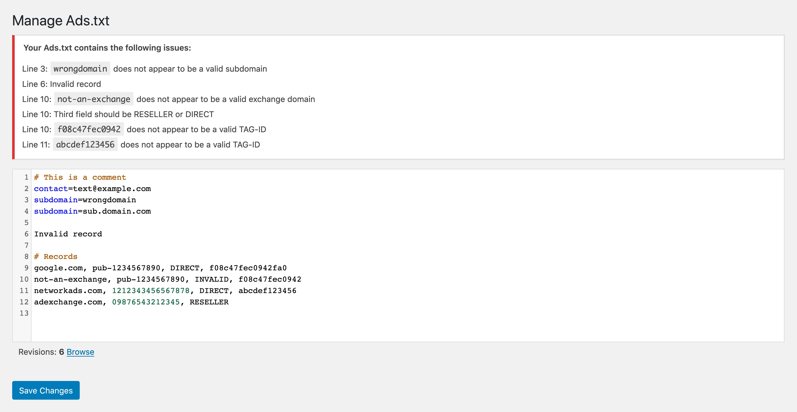

# Ads.txt Manager for WordPress

> Create, manage, and validate your ads.txt and app-ads.txt from within WordPress, just like any other content asset.

    

## Features

[Ads.txt](https://iabtechlab.com/ads-txt/) is an initiative by the Interactive Advertising Bureau to enable publishers to take control over who can sell their ad inventory. Through our work at 10up with various publishers, we've created a way to manage and validate your ads.txt file from within WordPress, eliminating the need to upload a file. The validation baked into the plugin helps avoid malformed records, which can cause issues that end up cached for up to 24 hours and can lead to a drop in ad revenue.

### What about ads.cert?

We're closely monitoring continued developments in the ad fraud space, and see this plugin as not only a way to create and manage your ads.txt file but also be prepared for future changes and upgrades to specifications. ads.cert is still in the extremely early stages so we don't see any immediate concerns with implementing ads.txt.

### Can I use this with multisite?

Yes! However, if you are using a subfolder installation it will only work for the main site. This is because you can only have one ads.txt for a given domain or subdomain per the [ads.txt spec](https://iabtechlab.com/ads-txt/).  Our recommendation is to only activate Ads.txt Manager per-site.

## Requirements

* Requires PHP 5.3+.
* Requires WordPress 4.9+. Older versions of WordPress will not display any syntax highlighting and may break JavaScript and/or be unable to localize the plugin.
* Ad blockers may break syntax highlighting and pre-save error checking on the edit screen. See [#20](https://github.com/10up/ads-txt/issues/20).
* Rewrites need to be enabled. Without rewrites, WordPress cannot know to supply `/ads.txt` when requested.
* Your site URL must not contain a path (e.g. `https://example.com/site/` or path-based multisite installs). While the plugin will appear to function in the admin, it will not display the contents at `https://example.com/site/ads.txt`. This is because the plugin follows the IAB spec, which requires that the ads.txt file be located at the root of a domain or subdomain.

## Installation

1. Install the plugin via the plugin installer, either by searching for it or uploading a .zip file.
1. Activate the plugin.
1. Head to Settings → Ads.txt or App-ads.txt and add the records you need.
1. Check it out at yoursite.com/ads.txt or yoursite.com/app-ads.txt!

Note: If you already have an existing ads.txt or app-ads.txt file in the web root, the plugin will not read in the contents of the respective files, and changes you make in WordPress admin will not overwrite contents of the physical files.

You will need to rename or remove the existing (app-)ads.txt file (keeping a copy of the records it contains to put into the new settings screen) before you will be able to see any changes you make to (app-)ads.txt inside the WordPress admin.

## Screenshots

### 1. Example of editing an ads.txt file with errors and a link to browse ads.txt file revisions.

### 2. Example of comparing ads.txt file revisions.

### 3. Example of comparing two disparate ads.txt file revisions.

## Support Level

**Active:** 10up is actively working on this, and we expect to continue work for the foreseeable future including keeping tested up to the most recent version of WordPress.  Bug reports, feature requests, questions, and pull requests are welcome.

## Changelog

A complete listing of all notable changes to Ads.txt Manager are documented in [CHANGELOG.md](CHANGELOG.md).

## Contributing

Please read [CODE_OF_CONDUCT.md](CODE_OF_CONDUCT.md) for details on our code of conduct, [CONTRIBUTING.md](CONTRIBUTING.md) for details on the process for submitting pull requests to us, and [CREDITS.md](CREDITS.md) for a listing of maintainers of, contributors to, and libraries used by Ads.txt Manager.

## Like what you see?

